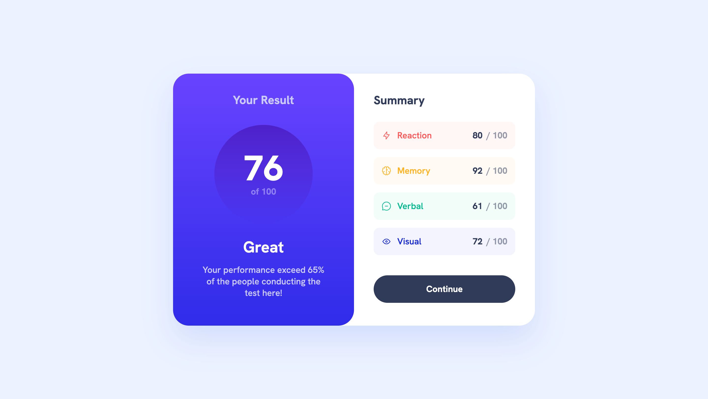

# Frontend Mentor - Results summary component solution

This is a solution to the [Results summary component challenge on Frontend Mentor](https://www.frontendmentor.io/challenges/results-summary-component-CE_K6s0maV). Frontend Mentor challenges help you improve your coding skills by building realistic projects. 

## Table of contents

- [Screenshot](#screenshot)
- [Links](#links)
- [Built with](#built-with)
- [Author](#author)

## Screenshot

## Links

- [Solution URL](https://www.frontendmentor.io/solutions/results-summary-component-0zYOVsg-FU)
- [Live Site URL](https://vicaleksa.github.io/results-summary-component/)

## Built with

- Flexbox

## Author

- Twitter - [@vicaleksa](https://www.twitter.com/vicaleksa)
- Frontend Mentor - [@vicaleksa](https://www.frontendmentor.io/profile/vicaleksa)
